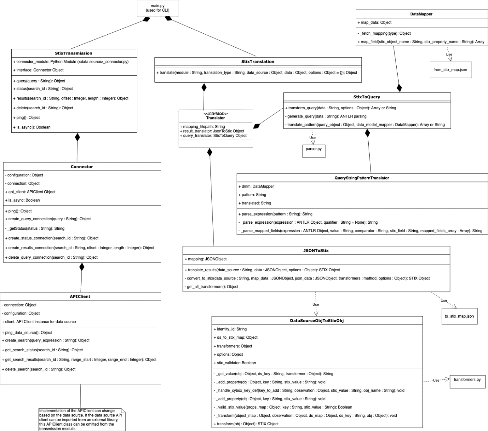

# STIX-SHIFTER

**Table of Contents**

- [Introduction](#introduction)
  - [What is STIX?](#what-is-stix)
  - [What is STIX-SHIFTER?](#what-is-stix-shifter)
  - [What is STIX Patterning? What are STIX Observations?](#what-is-stix-patterning-what-are-stix-observations)
  - [This sounds like Sigma, I already have that](#this-sounds-like-sigma-i-already-have-that)
  - [What is a STIX-SHIFTER connector?](#what-is-a-stix-shifter-connector)
  - [Why would I want to use this?](#why-would-i-want-to-use-this)
- [Available Connectors](#available-connectors)
- [How to use](#How-to-use)
  - [Translate](#translate)
  - [Transmit](#transmit)
  - [Execute](#execute)
  - [Debug](#Debug)
- [Limitations](#limitations)
- [Glossary](#glossary)
- [Architecture Context](#architecture-context)
- [Contributing](#contributing)
- [Guide for creating new connectors](adapter-guide/develop-stix-adapter.md)
- [Licensing](#licensing)

## Introduction

### What is STIX?

Structured Threat Information eXpression (STIX™) is a language and serialization format that organizations can use to exchange cyber threat intelligence (CTI). CTI is represented with objects and descriptive relationships and stored as JSON for machine readability.

STIX delivers a consistent and machine-readable way to enable collaborative threat analysis, automated threat exchange, automated detection and response, and more.

To learn more about STIX, see the following references:

- [Introduction to STIX](https://oasis-open.github.io/cti-documentation/stix/intro)
- [STIX and TAXII](https://docs.google.com/document/d/1yvqWaPPnPW-2NiVCLqzRszcx91ffMowfT5MmE9Nsy_w/edit?usp=sharing)

### What is STIX-SHIFTER?

STIX-shifter is an open source python library allowing software to connect to products that house data repositories by using `STIX Patterning`, and return results as `STIX Observations`.

### What is STIX Patterning? What are STIX Observations?

STIX 2 Patterning is a part of STIX that deals with the "matching things" part of STIX, which is an integral component of STIX Indicators.

##### An example of a STIX pattern:

`[url:value = 'http://www.testaddress.com'] OR [ipv4-addr:value = '192.168.122.84']`

This library takes in STIX 2 Patterns as input, and "finds" data that matches the patterns inside various products that house repositories of cybersecurity data. Examples of such products include SIEM systems, endpoint management systems, threat intelligence platforms, orchestration platforms, network control points, data lakes, and more.

In addition to "finding" the data by using these patterns, STIX-Shifter uniquely also _transforms the output_ into STIX 2 Observations. Why would we do that you ask? To put it simply - so that all of the security data, regardless of the source, mostly looks and behaves the same.

##### An example of a STIX Observation:

```json
{
  "id": "observed-data--cf2c58dc-200e-49e0-b6f7-e1997cccf707",
  "type": "observed-data",
  "created_by_ref": "identity--3532c56d-ea72-48be-a2ad-1a53f4c9c6d8",
  "objects": {
    "0": {
      "type": "network-traffic",
      "src_port": 567,
      "dst_port": 102,
      "src_ref": "1",
      "dst_ref": "2"
    },
    "1": {
      "type": "ipv4-addr",
      "value": "192.168.122.84"
    },
    "2": {
      "type": "ipv4-addr",
      "value": "127.0.0.1"
    },
    "3": {
      "type": "url",
      "value": "www.testaddress.com"
    }
  }
}
```

As anyone with experience in data science will tell you, the cleansing and normalizing of the data across domains, is one of the largest hurdles to overcome with attempting to build cross-platform security analytics. This is one of the barriers we are attempting to break down with STIX Shifter.

### This sounds like Sigma, I already have that

[Sigma](https://github.com/Neo23x0/sigma) and STIX Patterning have goals that are related, but at the end of the day has slightly different scopes. While Sigma seeks to be "for log files what Snort is for network traffic and YARA is for files", STIX Patterning's goal is to encompass _all three_ fundamental security data source types - network, file, and log - and do so simultaneously, allowing you to create complex queries and analytics that span domains. As such, so does STIX Shifter. It is critical to be able to create search patterns that span SIEM, Endpoint, Network, and File levels, in order to detect the complex patterns used in modern campaigns.

### What is a STIX-SHIFTER connector?

A STIX-shifter connector is a module inside Stix-Shifter library that implements an interface for:

- data source query and result set translation
- data source communication

Developing a new connector expands on the data sources that STIX-shifter can support.

The combination of translation and transmission functions allows for a single STIX pattern to generate a native query for each supported data source. Each query is run, and the results are translated back into STIX objects; allowing for a uniform presentation of data.

The objective is to have all the security data, regardless of the data source to look and behave the same.

### Why would I want to use this?

You might want to use this library and contribute to development, if any of the following are true:

- You are a vendor or project owner who wants to add some form of query or enrichment functions to your product capabilities
- You are an end user and want to have a way to script searches and/or queries as part of your orchestration flow
- You are a vendor or project owner who has data that can be made available, and you want to contribute a connector
- You just want to help make the world a safer place!

## Available Connectors

Each connector supports a set of STIX objects and properties as defined in the connector's mapping files. There is also a set of common STIX properties that all cyber observable objects must contain. See [STIX™ Version 2.0. Part 4: Cyber Observable Objects](http://docs.oasis-open.org/cti/stix/v2.0/stix-v2.0-part4-cyber-observable-objects.html) for more information on STIX objects.

### Common cyber observable properties
- created
- modified
- first_observed
- last_observed
- number_observed

Stix-shifter currently offers connector support for the following cybersecurity products. Click on a connector name in the following table to see a list of STIX attributes and properties it supports.

List updated: October 29, 2021

|         Connector          |      Module Name     | Data Model |  Developer   | Translation | Transmission | Availability |
| :------------------------: | :------------------: | :--------: | :----------: | :---------: | :----------: | :----------: |
|         [IBM QRadar](adapter-guide/connectors/qradar_supported_stix.md)         |        qradar        |  QRadar AQL   | IBM Security |     Yes     |     Yes      |   Released    |
|    [IBM QRadar on Cloud](adapter-guide/connectors/qradar_supported_stix.md)     |        qradar        | QRadar AQL | IBM Security |     Yes     |     Yes      |   Released    |
|         [HCL BigFix](adapter-guide/connectors/bigfix_supported_stix.md)         |        bigfix        |  Default   | IBM Security |     Yes     |     Yes      |   Released    |
|  [Carbon Black CB Response](adapter-guide/connectors/carbonblack_supported_stix.md)  |      carbonblack     |  Default   | IBM Security |     Yes     |     Yes      |   Released    |
|  [Carbon Black Cloud](adapter-guide/connectors/cbcloud_supported_stix.md)  |      cbcloud     |  Default   | IBM Security |     Yes     |     Yes      |   Released    |
|       Elasticsearch       |       elastic        | MITRE CAR  |    MITRE     |     Yes     |      No      |   Released    |
|       [Elasticsearch (ECS)](adapter-guide/connectors/elastic_ecs_supported_stix.md)       |     elastic_ecs      |    ECS     | IBM Security |     Yes     |     Yes      |   Released    |
| [IBM Cloud Security Advisor](adapter-guide/connectors/security_advisor_supported_stix.md) |   security_advisor   |  Default   |  IBM Cloud   |     Yes     |     Yes      |   Released    |
|           [Splunk Enterprise Security](adapter-guide/connectors/splunk_supported_stix.md)           |        splunk        | Splunk CIM | IBM Security |     Yes     |     Yes      |   Released    |
|       [Microsoft Defender for Endpoint](adapter-guide/connectors/msatp_supported_stix.md)        |        msatp         |  Default   | IBM Security |     Yes     |     Yes      |   Released    |
|       [Microsoft Azure Sentinel](adapter-guide/connectors/azure_sentinel_supported_stix.md)       |    azure_sentinel    |  Default   | IBM Security |     Yes     |     Yes      |   Released    |
|        [IBM Guardium Data Protection](adapter-guide/connectors/guardium_supported_stix.md)       |       guardium       |  Default   | IBM Security |     Yes     |     Yes      |   Released    |
|    [AWS CloudWatch Logs](adapter-guide/connectors/aws_cloud_watch_logs_supported_stix.md)     | aws_cloud_watch_logs |  Default   | IBM Security |     Yes     |     Yes      |   Released    |
|       [Amazon Athena](adapter-guide/connectors/aws_athena_supported_stix.md)       |   aws_athena   |  SQL   | IBM Security |     Yes     |     Yes      |   Released    |
|       [Alertflex](adapter-guide/connectors/alertflex_supported_stix.md)       |    alertflex    |  Default   | Alertflex |     Yes     |     Yes      |   Released    |
|       [Micro Focus ArcSight](adapter-guide/connectors/arcsight_supported_stix.md)       |    arcsight    |  Default   | IBM Security |     Yes     |     Yes      |   Released    |
|       [CrowdStrike Falcon](adapter-guide/connectors/crowdstrike_supported_stix.md)       |    crowdstrike    |  Default   | IBM Security |     Yes     |     Yes      |   Released    |
|       [Trend Micro Vision One](adapter-guide/connectors/trendmicro_vision_one_supported_stix.md)       |    trendmicro_vision_one    |  Default   | Trend Micro |     Yes     |     Yes      |   Released    |
|       [Secret Server](adapter-guide/connectors/secretserver_supported_stix.md)       |    secretserver    |  Default   | IBM |     Yes     |     Yes      |   Released    |
|       [One Login](adapter-guide/connectors/onelogin_supported_stix.md)       |    onelogin    |  Default   | GS Lab |     Yes     |     Yes      |   Released    |
|       MySQL                                                                  |    mysql    |  Default   | IBM |     Yes     |     Yes      |   Released    |
|       [Sumo Logic](adapter-guide/connectors/sumologic_supported_stix.md)       |    sumologic    |  Default   | GS Lab |     Yes     |     Yes      |   Released    |
|       [Datadog](adapter-guide/connectors/datadog_supported_stix.md)       |    datadog    |  Default   | GS Lab |     Yes     |     Yes      |   Released    |
|       [Infoblox BloxOne Threat Defense](adapter-guide/connectors/infoblox_supported_stix.md)       |    infoblox    |  Default   | Infoblox |     Yes     |     Yes      |   Released    |
|       [Proofpoint (SIEM API)](adapter-guide/connectors/proofpoint_supported_stix.md)       |    proofpoint    |  Default   | IBM Security |     Yes     |     Yes      |   Released    |
|       [Cybereason](https://github.com/opencybersecurityalliance/stix-shifter/blob/develop/adapter-guide/connectors/cybereason_supported_stix.md)                        | cybereason              | Default    | IBM Security | Yes         | Yes          | Released     |


## How to use

### Prerequisites

Python 3.6 is required to use stix-shifter.

Stix-shifter provides several functions: `translate` and `transmit` are the primary functions, `execute` offers a way to test the complete stix-shifter flow.

1. [**Translate**](#translate)

   The `translate` command converts STIX patterns into data source queries (in whatever query language the data source might use) and translates data source results (in JSON format) into bundled STIX observation objects.

2. [**Transmit**](#transmit)

   The `transmit` command allows stix-shifter to connect with products that house repositories of cybersecurity data. Connection and authentication credentials are passed to the data source APIs where stix-shifter can make calls to ping the data source, make queries, delete queries, check query status, and fetch query results.

3. [**Execute**](#execute)

   The translation and transmission functions can work in sequence by using the `execute` command from the CLI.

## Translate

### 1. Translate a STIX pattern to a native data source query

#### INPUT: STIX 2 pattern

```
# STIX Pattern:
"[url:value = 'http://www.testaddress.com'] OR [ipv4-addr:value = '192.168.122.84']"
```

#### OUTPUT: Native data source query

```
# Translated Query (using SQL as an example):
"SELECT * FROM tableName WHERE (Url = 'http://www.testaddress.com')
OR
((SourceIpV4 = '192.168.122.84' OR DestinationIpV4 = '192.168.122.84'))"
```

### CLI Command
Open a terminal and navigate to your python 3 environment. Translation of a **query** is called in the format of:

`stix-shifter translate <MODULE NAME> query "<STIX IDENTITY OBJECT>" "<STIX PATTERN>" "<OPTIONS>"`

Alternatively, you can run the CLI commands from the source. Open a terminal and navigate to the stix-shifter root directory. Translation of a **query** is called in the format of:

`python main.py translate <MODULE NAME> query "<STIX IDENTITY OBJECT>" "<STIX PATTERN>" "<OPTIONS>"`

The module name refers to the name of the folder in stix-shifter that contains the connector code. The current module names can be found in the [Available Connectors](#available-connectors) table above. The STIX identity object is only used when translating data source results into STIX, so it can be passed in as an empty object for query translation calls.

Using the Qradar connector as an example:

`python main.py translate qradar query "{}" "[url:value = 'http://www.testaddress.com'] OR [ipv4-addr:value = '192.168.122.84']"`

### Pattern translation using an input file

Create a text file with the pattern you wish to translate. The file can be used in the query translation call using standard input.

_pattern.txt_
```
[network-traffic:src_ref.value = '127.0.0.1'] OR [ipv4-addr:value = '0.0.0.0']
```

`python main.py translate qradar query '{}' '' < /path/to/file/pattern.txt`

### 2. Translate a JSON data source query result to a STIX 2.0 bundle of observable objects

#### INPUT: JSON data source query result

```
# Datasource results (in JSON format):
[
    {
        "SourcePort": 567,
        "DestinationPort": 102,
        "SourceIpV4": "192.168.122.84",
        "DestinationIpV4": "127.0.0.1",
        "Url": "www.testaddress.com"
    }
]
```

#### OUTPUT: STIX 2.0 bundle of observable objects

```
# STIX Observables
{
    "type": "bundle",
    "id": "bundle--2042a6e9-7f34-4a03-a745-502e358594c3",
    "spec_version": "2.0",
    "objects": [
        {
            "type": "identity",
            "id": "identity--3532c56d-ea72-48be-a2ad-1a53f4c9c6d8",
            "name": "YourDataSource",
            "identity_class": "events"
        },
        {
            "id": "observed-data--cf2c58dc-200e-49e0-b6f7-e1997cccf707",
            "type": "observed-data",
            "created_by_ref": "identity--3532c56d-ea72-48be-a2ad-1a53f4c9c6d8",
            "objects": {
                "0": {
                    "type": "network-traffic",
                    "src_port": 567,
                    "dst_port": 102,
                    "src_ref": "1",
                    "dst_ref": "2"
                },
                "1": {
                    "type": "ipv4-addr",
                    "value": "192.168.122.84"
                },
                "2": {
                    "type": "ipv4-addr",
                    "value": "127.0.0.1"
                },
                "3": {
                    "type": "url",
                    "value": "www.testaddress.com"
                }
            }
        }
    ]
}
```

### CLI Command
Open a terminal and navigate to your python 3 environment. Translation of a **results** is called in the format of:

`stix-shifter translate <MODULE NAME> result '<STIX IDENTITY OBJECT>' '<LIST OF JSON RESULTS>'`

Alternatively, you can run the CLI commands from the source. Open a terminal and navigate to the stix-shifter root directory. Translation of **results** is called in the format of:

`python main.py translate <MODULE NAME> result '<STIX IDENTITY OBJECT>' '<LIST OF JSON RESULTS>'`

The module name refers to the name of the folder in stix-shifter that contains the connector code. The current module names can be found in the [Available Connectors](#available-connectors) table above. The STIX Identity object represents the data source and is passed in to allow stix-shifter to create a reference between the data source and the generated STIX observed objects.

Using the QRadar connector as an example:

```
python main.py translate qradar results \
'{"type": "identity", "id": "identity--3532c56d-ea72-48be-a2ad-1a53f4c9c6d3", "name": "QRadar", "identity_class": "events"}' \
'[{"sourceip": "192.0.2.0", "filename": "someFile.exe", "sourceport": "0123", "username": "root"}]'
```

### Translating results into STIX 2.1

By default, JSON results are translated into STIX 2.0. To return STIX 2.1 results include `'{"stix_2.1": true}'` in the CLI command

```
python main.py translate qradar results \
'{"type": "identity", "id": "identity--3532c56d-ea72-48be-a2ad-1a53f4c9c6d3", "name": "QRadar", "identity_class": "events"}' \
'[{"sourceip": "192.0.2.0", "filename": "someFile.exe", "sourceport": "0123", "username": "root"}]' '{"stix_2.1": true}'
```


### Validating translated STIX 2.1 bundle from the CLI

You can validate translated STIX results from the CLI provided they conform to the 2.1 standard. The `--stix-validator` flag at the end will run validation on the returned STIX objects to ensure they conform to the STIX 2.1 standard. Alternatively, `'{ "stix_validator": true }'` can be passed in at the end as an options dictionary.

```
python main.py translate qradar results \
'{"type": "identity", "id": "identity--3532c56d-ea72-48be-a2ad-1a53f4c9c6d3", "name": "QRadar", "identity_class": "events"}' \
'[{"sourceip": "192.0.2.0", "filename": "someFile.exe", "sourceport": "0123", "username": "root"}]' '{"stix_2.1": true, "stix_validator: true}'
```

### Validating STIX 2.0 and 2.1 bundles with the validator script

Refer to the [STIX validator](bundle_validator/README.md)

### Results translation using an input file

Create a JSON file with the results you wish to translate. The file can be used in the results translation call using standard input.

_results.json_
```
[
    {
        "starttime": "1563892019916",
        "endtime": "1563892019916",
        "sourceip": "9.21.122.127",
        "sourceport": "100",
        "identityip": "0.0.0.0",
        "destinationip": "127.0.0.1",
        "destinationport": "800",
        "username": "admin",
        "protocol": "tcp"
    }
]
```

`python main.py translate qradar results '{"type": "identity","id": "identity--f431f809-377b-45e0-aa1c-6a4751cae5ff","name": "QRadar","identity_class": "system"}' '' < /path/to/file/results.json`

## Transmit

### Connection and Configuration objects

STIX-shifter expects connection and configuration objects to be passed in during transmission calls. The connection object contains the host address and port of the data source being connected to, as well as an optional server name indicator (SNI) and self signed certificate.

#### Connection

This object contains information needed to connect to a specific data source. The `host` and `port` keys are required.

```
{
    "host": <Host URL or IP address>,
    "port": <Port>,
    "sni": <Server name indicator>,
    "selfSignedCert": <false or Certificate>,
    "cert": <Certificate (if required)>,
    "resultSizeLimit": <Results limit to come back from the data source query>,
    "timeRange": <Default query time range in minutes>,
    "options": {<Any required options specific to the particular data source>}
}
```

#### Configuration

This object contains an `auth` key who's value stores authentication information for the data source. What keys and values get stored in the auth will depend on the authentication requirements of the data source.

```
{
    "auth": {
        "username": <Username>,
        "password": <Password>
    }
}
```

```
{
    "auth": {
        "tenant": <Tenant>,
        "clientId": <Client ID>,
        "clientSecret": <Client Secret>
    }
}
```

```
{
    "auth": {
        "SEC": <SEC Token>
    }
}
```

```
{
    "auth": {
        "token": <Security Token>
    }
}
```

```
{
    "auth": {
        "accountId": <Account ID>,
        "apiKey": <API Key>
    }
}
```

### Transmit functions

Transmit offers several functions: `ping`, `query`, `status` (for asynchronous data sources), `results`, `delete` (if supported by the data source), and `is_async`.

Each of the transmit functions takes in common arguments: the module name, the connection object, and the configuration object. The module name refers to the name of the folder in stix-shifter that contains the connector code. The current module names can be found in the [Available Connectors](#available-connectors) table above. Information on the [connection and configuration objects](#transmit) can also be found above. Each of the CLI commands can be run from a terminal in the stix-shifter root director.

Any failed transmission function call will return an error in the format of:

`{'success': False, 'error': <Error message reported by API>, 'code': <Error code>}`

### Ping

Uses the data source API to ping the connection.

#### CLI Command

`stix-shifter transmit <MODULE NAME> '<CONNECTION OBJECT>' '<CONFIGURATION OBJECT>' ping`

#### OUTPUT:

`{'success': True}`

### Query

Uses the data source API to submit a query to the connection.

#### CLI Command

`stix-shifter transmit <MODULE NAME> '<CONNECTION OBJECT>' '<CONFIGURATION OBJECT>' query <NATIVE DATA SOURCE QUERY>`

#### OUTPUT:

`{'success': True, 'search_id': <SEARCH ID>}`

An asynchronous data source will typically return a search ID supplied by the API response. In the event where the API doesn't return a search id, such as with a synchronous data source, the search id will be defined in the transmission module.

### Status

Uses the data source API to look up the query status based on the `search_id` that is returned from the query call. This is only used for asynchronous data sources where the results are not returned right after making a query call.

#### CLI Command

`stix-shifter transmit <MODULE NAME> '<CONNECTION OBJECT>' '<CONFIGURATION OBJECT>' status <SEARCH ID>`

#### OUTPUT:

`{'success': True, 'status': <STATUS>, 'progress': <QUERY PERCENTAGE COMPLETE>}`

The status can be one of: `COMPLETED`, `ERROR`, `CANCELLED`, `TIMEOUT`, or `RUNNING`. Depending on the data source, the progress may return with less than 100 while still showing the status as completed.

### Results

Uses the data source API to fetch the query results based on the search ID, offset, and length.

#### CLI Command

`stix-shifter transmit <MODULE NAME> '<CONNECTION OBJECT>' '<CONFIGURATION OBJECT>' results <SEARCH ID> <OFFSET> <LENGTH>`

#### OUTPUT:

`{'success': True, 'data': [<QUERY RESULTS>]}`

The `OFFSET` and `LENGTH` control what pages/rows of data are returned in the query results.

### Results as STIX

Uses the data source API to fetch the query results based on the search ID, offset, and length, and transforms into a bundle of STIX objects.

#### CLI Command

`stix-shifter transmit <MODULE NAME> '<CONNECTION OBJECT>' '<CONFIGURATION OBJECT>' results_stix <SEARCH ID> <OFFSET> <LENGTH> '<STIX IDENTITY OBJECT>'`

#### OUTPUT:

STIX bundle of objects.

The `OFFSET` and `LENGTH` control what pages/rows of data are returned in the query results.

### Is Async

Checks if the data source connection is asynchronous.

#### CLI Command

`stix-shifter transmit <MODULE NAME> '<CONNECTION OBJECT>' '<CONFIGURATION OBJECT>' is_async`

#### OUTPUT:

`True` or `False`

## Execute

The `execute` command tests all steps of the translation-transmission flow:

1. A STIX pattern is translated into a list of one or more native data source queries (using a **translate query** call).
2. Each translated query in the list is sent to the data source via a **transmit query** call.
3. If the data source is asynchronous, a **transmit status** call is made for each query. Otherwise the flow moves to the next step.
4. A **transmit results** call is made for each query (using the returned query ID in step 2). If data is returned, the resulting JSON objects get added to a list.
5. The list of JSON results get translated into a bundle of STIX objects with a **translate query** call. This bundle includes the STIX `identity` object and `observed-data` objects.

### CLI Command

`stix-shifter execute <TRANSMISSION MODULE NAME> <TRANSLATION MODULE NAME> '<STIX IDENTITY OBJECT>' '<CONNECTION OBJECT>' '<CONFIGURATION OBJECT>' '<STIX PATTERN>'`

### Debug

You can add the `--debug` option to your CLI command to see more logs. 

`stix-shifter --debug execute <TRANSMISSION MODULE NAME> <TRANSLATION MODULE NAME> '<STIX IDENTITY OBJECT>' '<CONNECTION OBJECT>' '<CONFIGURATION OBJECT>' '<STIX PATTERN>'` 

### Change max returned results

You can add the `--results` option with an integer value at the end of your CLI command to limit the maximum number of returned search results (default 10).

`stix-shifter execute <TRANSMISSION MODULE NAME> <TRANSLATION MODULE NAME> '<STIX IDENTITY OBJECT>' '<CONNECTION OBJECT>' '<CONFIGURATION OBJECT>' '<STIX PATTERN>' --results 50`

### Save the STIX results to a file

You can redirect the output of your CLI command to a file to save the STIX results.

`stix-shifter execute <TRANSMISSION MODULE NAME> <TRANSLATION MODULE NAME> '<STIX IDENTITY OBJECT>' '<CONNECTION OBJECT>' '<CONFIGURATION OBJECT>' '<STIX PATTERN>' > results.json`

## Modules

The `modules` command will return a JSON of the existing connectors along with their dialects and supported languages that are used in query translation. 

### CLI Command

`python main.py modules`

returns
```
{
    "qradar": {
        "flows": {
            "language": "stix",
            "default": true
        },
        "events": {
            "language": "stix",
            "default": true
        },
        "aql": {
            "language": "aql",
            "default": false
        }
    },
    "security_advisor": {
        "default": {
            "language": "stix",
            "default": true
        }
    },
    ...
}
```

In the above example, the QRadar connector can use three dialects: `flows`, `events`, and `aql`. When a connector only has a `default` dialect, such as with Security Advisor, only one dialect is used by the connector. Most dialects will use the `stix` language since they translate STIX patterns into native queries. QRadar's `aql` dialect uses the `aql` language since it is meant to accept an AQL query rather than a STIX pattern. See the [QRadar connector README](stix_shifter_modules/qradar/README.md) for more information on AQL passthrough.

### OUTPUT:

A bundle of STIX objects

## Limitations

STIX-Shifter has limitations on the length of a pattern that can be translated into a native query. As the pattern length increases, the translation time increases exponentially due to how ANTLR 4 parses the pattern. See [STIX-Shifter Limitations](adapter-guide/stix-shifter-limitations.md) for more details.  

## Glossary

| Terms                     | Definition                                                                                                                                                                                              |
| ------------------------- | ------------------------------------------------------------------------------------------------------------------------------------------------------------------------------------------------------- |
| Modules                   | Folders in the stix-shifter project that contains code that is specific to a data source.                                                                                                               |
| STIX 2 patterns           | STIX patterns are expressions that represent Cyber Observable objects within a STIX Indicator STIX Domain Objects (SDOs). <br>They are helpful for modeling intelligence that indicates cyber activity. |
| STIX 2 objects            | JSON objects that contain CTI data. In STIX, these objects are referred to as Cyber Observable Objects.                                                                                                 |
| Data sources              | Security products that house data repositories.                                                                                                                                                         |
| Data source queries       | Queries written in the data source's native query language.                                                                                                                                             |
| Data source query results | Data returned from a data source query.                                                                                                                                                                 |

## Architecture Context



## Contributing

We are thrilled you are considering contributing! We welcome all contributors.

Please read our [guidelines for contributing](CONTRIBUTING.md).

## Guide for creating new connectors

If you want to create a new connector for STIX-shifter, see the [developer guide](adapter-guide/develop-stix-adapter.md)

## Licensing

Licensed under the Apache License, Version 2.0 (the "License");
you may not use this file except in compliance with the License.
You may obtain a copy of the License at

    http://www.apache.org/licenses/LICENSE-2.0

Unless required by applicable law or agreed to in writing, software
distributed under the License is distributed on an "AS IS" BASIS,
WITHOUT WARRANTIES OR CONDITIONS OF ANY KIND, either express or implied.
See the License for the specific language governing permissions and
limitations under the License.
