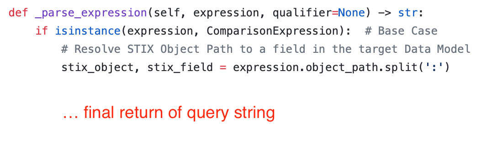

# STIX Translation

The steps below assume you have renamed the `async_dummy` module directory to our example connector name, `abc_security_monitor`.


1. [Exploring the stix_translation directory](#step-1-exploring-the-stix_translation-directory)
1. [Edit the from_stix_map.json file](#step-2-edit-the-from_stix_map-json-file)
1. [Edit the query_constructor.py file](#step-3-edit-the-query-constructor-file)
1. [Edit the to_stix_map.json file](#step-4-edit-the-to_stix_map-json-file)
1. [If required by your data source, update the transformers.py file](#step-5-if-required-by-your-data-source-update-the-transformers-file)
1. [Verify that the translation module was created successfully](#step-6-verify-that-the-translation-module-was-created-successfully)

## Step 1. Exploring the stix_translation directory

Verify that your `stix_translation` directory contains the following folders and files.

| Folder/file             | Why is it important? Where is it used?                                                                                                                                                                                                                                                                     |
| ----------------------- | ---------------------------------------------------------------------------------------------------------------------------------------------------------------------------------------------------------------------------------------------------------------------------------------------------------- |
| json/\<DIALECT\>_from_stix_map.json | These mapping files are used to translate a STIX pattern to a data source query result.                                                                                                                                                                                                                       |
| json/to_stix_map.json   | This mapping file is used to translate a data source query result into STIX objects.                                                                                                                                                                                                                       |
| \_\_init\_\_.py             | This file is required by Python to properly handle library directories.                                                                                                                                                                                                                                    |
| query_constructor.py    | This file contains the QueryStringPatternTranslator class, which translates the ANTLR parsing of the STIX pattern to the native data source query.                                                                                                                                                         |
| query_translator.py        | This file contains the QueryTranslator class, which inherits the BaseQueryTranslator class. <br><br>QueryTranslator calls out to the ANTLR parser, which returns a parsing of the STIX pattern. The parsing is then passed onto the query_constructor.py where it is translated into the native data source query. |

[Back to top](#stix-translation)

## Step 2. Edit the from_stix_map JSON files

The `<DIALECT>_from_stix_map.json` files is where you define HOW to translate a STIX pattern to a native data source query. STIX patterns are expressions that represent Cyber Observable objects. The mapping of STIX objects and properties to data source fields determine how a STIX pattern is translated to a data source query.

1. Identify your data source fields.
2. Refer to the following documentation [STIX™ Version 2.0. Part 4: Cyber Observable Objects](http://docs.oasis-open.org/cti/stix/v2.0/stix-v2.0-part4-cyber-observable-objects.html) for the list of STIX objects that you can map your data source fields.
3. Edit the `from_stix_map.json` file found in the `json` directory. The `dialect1_from_stix_map.json` file contains a sample mapping of STIX objects and properties to data source fields in the following format:
   ```
   {
       "stix-object": {
           "fields": {
               "stix_object_property": ["DataSourceField", "DataSourceField"],
               "stix_object_property": ["DataSourceField"]
           }
       }
   }
   ```
4. Map your data source fields to a STIX object and property. Define the mapping based on the specified format. You can map multiple data source fields to the same STIX object property.
   - "stix-object" refer to a STIX cyber observable object type name
   - "stix_object_property" refers to a STIX cyber observable object property name

**Example mapping**

The following example illustrates the mapping of STIX objects (network-traffic, ipv4-addr, and url) to a data source with the fields – SourcePort, DestinationPort, StartTime, EndTime, NetworkProtocol, SourceIpV4, DestinationIpV4, and Url.

```
{
    "network-traffic": {
        "fields": {
          "src_port": ["SourcePort"],
          "dst_port": ["DestinationPort"],
          "start": ["StartTime"],
          "end": ["EndTime"],
          "protocols[*]": ["NetworkProtocol"]
        }
      },
      "ipv4-addr": {
        "fields": {
          "value": ["SourceIpV4", "DestinationIpV4"]
        }
      },
      "url": {
          "fields": {
              "value": ["Url"]
          }
      }
}
```

The following STIX pattern is supported in the example mapping because the STIX objects (network-traffic and ipv4-addr) and their properties are defined in the file and mapped to data source fields.

```
"[network-traffic:src_port = 12345 AND ipv4-addr:value = '00-00-5E-00-53-00']"
```

**Using multiple from-STIX map files with dialects**

Pattern translation can use dialects to differentiate between multiple from-STIX mapping files. Multiple from-STIX mappings may be needed in cases where one STIX pattern queries multiple data source tables that use different schemas. Any dialects are appended to the module name with the following format: `<module_name>:<dialect_1>:<dialect_2>` Using QRadar as an example, one pattern queries both event and flow tables. This requires a from-STIX mapping file for each, which results in one pattern translating into two AQL queries. QRadar's module name would be passed to the `StixTranslation.translate` method as `qradar:events:flows`. Each dialect gets extracted from the module name and is used throughout the pattern translation flow. In cases where multiple from-STIX map files are used, the naming convention is `<dialect>_from_stix_map.json`. It is important that the file names follow this structure since the dialect is used to dynamically look up the file path. So in the case of QRadar, there would be a `events_from_stix_map.json` and `flows_from_stix_map.json` file in the json folder. The dialect can also be used in the `query_constructor` (detailed below) if it's needed in the translated query string. In the case of an SQL language, this may look like `SELECT * FROM <dialect> WHERE <some condition>`

If your data source uses multiple dialects, rename the `<DIALECT>_from_stix_map.json` files to include the dialect at the beginning of the file name. Include as many mapping files as needed; one for each dialect. If your data source only uses one dialect, include only one from-STIX mapping file with the name `from_stix_map.json` in the json directory.

[Back to top](#stix-translation)

**Using Custom STIX Objects and Properties**

As shown below in [Step 4](#step-4-edit-the-to_stix_map-json-file), custom objects and properties are supported by the STIX standard and can be used when defining mappings. However, services using stix-shifter may be unaware of any custom elements and so only rely on standard STIX objects when constructing queries. Therefore it is recommended to stick to standard objects and attributes (as outlined in the STIX [documentation](http://docs.oasis-open.org/cti/stix/v2.0/stix-v2.0-part4-cyber-observable-objects.html)) when constructing the `from_stix_map`.

## Step 3. Edit the query constructor file

When a STIX pattern is translated by STIX-shifter, it is first parsed with ANTLR 4 into nested expression objects. The native data source query is constructed from these nested objects.

The following STIX pattern:

```
"[network-traffic:src_port = 37020 AND network-traffic:dst_port = 635] START '2016-06-01T00:00:00Z' STOP '2016-06-01T01:11:11Z'"
```

Translates into the following ANTLR parsing:

```
Pattern[
    ObservationExpression(
        CombinedComparisonExpression(
            ComparisonExpression(
                network-traffic:dst_port ComparisonComparators.Equal 635
            )
            ComparisonExpressionOperators.And
            ComparisonExpression(
                network-traffic:src_port ComparisonComparators.Equal 37020
            )
        )
    )
    Qualifier(
        STARTt'2016-06-01T00:00:00Z'STOPt'2016-06-01T01:11:11Z'
    )
]
```

The parsing is recursively run through QueryStringPatternTranslator.\_parse_expression, which is found in `query_constructor.py`.

The `query_constructor.py` file is where the native query is built from the ANTLR parsing.

---

### How STIX-shifter handles unmapped STIX properties

If a STIX pattern contains an unmapped property, and any joining operators allow for it, that portion of the parsing is removed from the ANTLR objects. The modified ANTLR parsing is then transformed into one or more native queries by the query constructor. Looking at the following examples:

`[stix_object:unmapped_property OR stix_object:mapped_property]`

_The unmapped property would be removed since it is joined to a mapped property with an OR operator._

`[stix_object:unmapped_property] OR [stix_object:mapped_property]`

_The entire observation object (square brackets) containing the unmapped property would be removed since the pattern contains at least one other observation with mapped properties._

If the unmapped property cannot be removed, STIX-shifter produces an error. This happens because the `QueryStringPatternTranslator` class (in `query_constructor.py`) does not know what data source field the STIX object property must be converted to. The following patterns would produce such an error:

`[stix_object:unmapped_property AND stix_object:mapped_property]`

_The unmapped property cannot be removed without changing the query logic since the two properties are joined by an AND operator._

`[stix_object:unmapped_property]`

_The pattern only contains one observation with one unmapped property; nothing would be left to the query after removing it._

---

Edit the `query_constructor.py` file in the translation directory. Update the following sections based on the requirements of your data source.

### 1. Define the comparator_lookup mapping

The comparator_lookup maps the STIX pattern operators to the data source query operators. Change the comparator values to match the operators supported in your data source.

The default operators that are defined in your translation module are the ones that are used in an SQL query.


| STIX pattern operators                           | Data source query operators |
| ------------------------------------------------ | --------------------------- |
| ComparisonExpressionOperators.And                | And                         |
| ComparisonExpressionOperators.Or                 | OR                          |
| ComparisonExpressionOperators.GreaterThan        | >                           |
| ComparisonExpressionOperators.GreaterThanOrEqual | >=                          |
| ComparisonExpressionOperators.LessThan           | <                           |
| ComparisonComparators.LessThanOrEqual            | <=                          |
| ComparisonComparators.Equal                      | =                           |
| ComparisonComparators.NotEqual                   | !=                          |
| ComparisonComparators.Like                       | LIKE                        |
| ComparisonComparators.In                         | IN                          |
| ComparisonComparators.Matches                    | LIKE                        |

### 2. Define the \_parse_expression method

The ANTLR parsing is recursively run through the \_parse_expression method. The type of expression is determined on each iteration. When the expression is a ComparisonExpression, a query string is added to the final data source query.

This image illustrates where the query string is constructed for the data source query.



The following ComparisonExpression from an ANTLR parsing:

```
ComparisonExpression(
   network-traffic:src_port ComparisonComparators.Equal 37020
)
```

Would add the following string to the native query:
`"SourcePort = 37020"`

### 3. Define the final query that gets returned in the translate_pattern method

Depending on your data source, edit this section to:

- Add a query field selector.
- Append result limits and time windows.
- Return a list of one or more queries. A list is returned because some query languages require the STIX pattern to be split into multiple query strings.

The example provided in the dummy connector is based on an SQL language. This should to be changed to fit with the native data source query language. Each string in the return list is a query that will be passed to the data source's API via the STIX transmission `<module>_connector.py`. If the data source does not use a query language, API end points and parameters could be defined here instead (in conjunction with `<DIALECT>_from_stix_map.json`).

[Back to top](#stix-translation)

## Step 4. Edit the to_stix_map JSON file

The `to_stix_map.json` file is where you define HOW to translate data source query results into a bundle of STIX objects. Query results must be in JSON format; otherwise, the data source cannot be supported.

Results from unmapped data source fields are ignored during translation and are not included in the bundle.

1. Identify your data source fields.
2. Refer to the following documentation [STIX™ Version 2.0. Part 4: Cyber Observable Objects](http://docs.oasis-open.org/cti/stix/v2.0/stix-v2.0-part4-cyber-observable-objects.html) for the list of STIX objects that you can map your data source fields.
3. Edit the `to_stix_map.json` file in the `translation/json` directory. The `to_stix_map.json` file contains a sample mapping of data source fields to STIX objects and properties in the following format:

   ```
   {
       "DataSourceField": {
           "key": "stix-object.stix_object_property"
       },
       "DataSourceField": {
           "key": "x_custom_object.property",
           "cybox": false
       }
   }
   ```

4. Each JSON object in the mapping has a "key" element with a value that represents a STIX object and its property. Define the mapping based on the specified format.
   - `stix-object` refer to a STIX cyber observable object type name
   - `stix_object_property` refers to a STIX cyber observable object property name
   - `x_custom_object.property` refers to a custom object and its property that you can use for fields that don't map to any STIX objects
   - Mappings for custom properties must have a `cybox` key set to false. This setting identifies custom objects during the translation process.

**Example mapping**
Using the same data source as in step 3, the following example shows a to-STIX mapping:

```
{
    "Url": {
        "key": "url.value"
    },
    "SourcePort": {
        "key": "network-traffic.src_port",
        "object": "nt",
        "transformer": "ToInteger"
    },
    "DestinationPort": {
        "key": "network-traffic.dst_port",
        "object": "nt",
        "transformer": "ToInteger"
    },
    "SourceIpV4": [
        {
          "key": "ipv4-addr.value",
          "object": "src_ip"
        },
        {
          "key": "network-traffic.src_ref",
          "object": "nt",
          "references": "src_ip"
        }
      ],
    "DestinationIpV4": [
        {
            "key": "ipv4-addr.value",
            "object": "dst_ip"
        },
        {
            "key": "network-traffic.dst_ref",
            "object": "nt",
            "references": "dst_ip"
        }
    ],
    "NetworkProtocol": {
        "key": "network-traffic.protocols",
        "object": "nt",
        "transformer": "ToLowercaseArray"
    },
    "LogSourceId": {
        "key": "x_my_data_source.log_source",
        "cybox": false
    },
    "EventTime": [
        {
            "key": "created",
            "cybox": false
        },
        {
            "key": "modified",
            "cybox": false
        },
        {
            "key": "first_observed",
            "cybox": false
        },
        {
            "key": "last_observed",
            "cybox": false
        }
    ]
}
```

**About the example mapping**

- Url is a simple mapping.
- SourcePort and DestinationPort
  - Have matching "object" values, which cause the src_port and dst_port to be added to the same object (in this case, network-traffic).
  - Uses the ToInteger transformer. Transformers are optional mapping attributes that apply a transformation method to the data before it is written to the STIX object. The existing transform methods are in `stix_shifter_utils/stix_translation/src/utils/transformers.py`. Any new transformers must be added to this file.
- SourceIpV4 and DestinationIpV4 contain two objects.
  - The first object creates an ipv4-addr object for each of the values. Given the field, the "object" property is set to either src_ip or dst_ip.
  - The second object in the mapping adds references in the network-traffic object to the ipv4-addr objects. Since the second part of the mappings has the object set to "nt", the references are added to the same network-traffic object that contains the source and destination ports.
- NetworkProtocol
  - Mapped similarly to the source and destination ports.
  - Note the use of the ToLowercaseArray transformer. The example data source returns a single string in the NetworkProtocol field. However, in STIX, network-traffic protocols store an array of protocols in lowercase format.
- LogSourceId
  - An example of a custom STIX property.
  - Custom properties allow for data that would not fit in any existing STIX object type to be added to the observed-data object. Custom properties must start with an x\_. In this example, the data source name is used as the custom object name and log_source is the custom property.
- EventTime
  - Data source field indicating the time of the event.
  - Maps to the following STIX fields: created, modified, first_observed, last_observed

**Example observed-data STIX object**

**Input data**

| Url             | SourcePort | DestinationPort | SourceIpV4 | DestinationIpV4 | NetworkProtocol | LogSourceId | EventTime                |
| --------------- | ---------- | --------------- | ---------- | --------------- | --------------- | ----------- | ------------------------ |
| www.example.com | 3000       | 1000            | 192.0.2.0  | 198.51.100.0    | TCP             | 678         | 2019-04-24T12:44:00.605Z |

**Output**

The following illustrates an observed-data STIX object that is derived from the previous example mapping and sample input data.

```
{
      "id": "observed-data--6ecb744f-37d2-4950-a7bb-9dc821679c52",
      "type": "observed-data",
      "created_by_ref": "identity--f431f809-377b-45e0-aa1c-6a4751cae5ff",
      "created": "2019-04-24T12:44:00.605Z",
      "first_observed": "2019-04-24T12:44:00.605Z",
      "last_observed": "2019-04-24T12:44:00.605Z",
      "modified": "2019-04-24T12:44:00.605Z",
      "number_observed": 1,
      "objects": {
        "0": {
          "type": "ipv4-addr",
          "value": "192.0.2.0"
        },
        "1": {
          "type": "network-traffic",
          "src_ref": "0",
          "src_port": 3000,
          "dst_ref": "2",
          "dst_port": 1000
        },
        "2": {
          "type": "ipv4-addr",
          "value": "198.51.100.0"
        },
        "3": {
          "type": "url",
          "value": "www.example.com"
        }
      },
      "x_my_data_source": {
        "log_source": 678
      }
    }
```

**Required fields:**

Every STIX observed-data object must include the following properties: 

| Property | Description |
| --- | ------------------------------------------------ |
| id | Object ID. Created automatically during results translation. |
| type | Object type. This will always be `observed-data` and is created automatically during results translation. |
| created_by_ref | References the identity object that represents the data source. Created automatically during results translation. | 
| created | Timestamp when the observed-data object was written to STIX. Created automatically during results translation. |
| modified | Timestamp when the current observed-data STIX object was last modified. This will often be the same value as the created property and is created automatically during results translation. |
| first_observed | Timestamp when the event that created the observed-data object was first observed. Must be defined in the to-STIX mapping. | 
| last_observed | Timestamp when the event that created the observed-data object was last observed. Must be defined in the to-STIX mapping. | 
| number_observed | The number of the same events that get returned in the results. Can be defined in the to-STIX mapping if an event count is returned in the results, otherwise this should have a default of 1. |

The code for translating data source results to STIX is found in `stix_shifter_utils/stix_translation/src/json_to_stix/json_to_stix_translator.py`. Normally, there is no need to edit this file.

[Back to top](#stix-translation)

## Step 5. If required by your data source, update the transformers file

The `transformers.py` file is located in `stix_shifter_utils/stix_translation/src/utils/transformers.py`. It contains classes that transform data formats. Each class has a method that takes in data and transforms it into the preferred format. For example, an integer value is transformed into a string. These classes can be used in cases such as:

- When converting from STIX, the data source query language requires specific data formats. For example, time stamps. In this case, the format of a value in the STIX pattern must be transformed during pattern translation if the STIX and query language data formats are different.
- When converting to STIX, the STIX object requires specific data formats. In this case, the format of a value that is returned in the data source results must be transformed during translation into a bundle of STIX objects. See [STIX™ Version 2.0. Part 4: Cyber Observable Objects](http://docs.oasis-open.org/cti/stix/v2.0/stix-v2.0-part4-cyber-observable-objects.html) for STIX data formats.

[Back to top](#stix-translation)


## Step 6. Verify that the translation module was created successfully

You must have access to the data source either through a UI or CLI so that you can run the translated query and confirm that it works.
The translation module can be tested by calling the `main.py file` from the command line and passing in the required arguments. The order of arguments is as follows:

```
python main.py translate <data source (module) name> <"query" or "result"> <STIX identity object> <pattern or JSON results to
be translated> <options>
```

### Test the STIX pattern to data source query translation

1. Run the translation module from the command line. For example, using `abc_security_monitor` as a data source:

```
python main.py translate abc_security_monitor query '{}' "[network-traffic:src_port = 37020 and network-traffic:dst_port = 635] OR [ipv4-addr:value = '333.333.333.0'] AND [url:value = 'www.example.com'] START t'2019-01-28T12:24:01.009Z' STOP t'2019-01-28T12:54:01.009Z'"
```

To run validation on the STIX pattern, add `'{"validate_pattern": "true"}'` as an option to the end of the CLI command:

```
python main.py translate abc_security_monitor query '{}' "[network-traffic:src_port = 37020 and network-traffic:dst_port = 635] OR [ipv4-addr:value = '333.333.333.0'] AND [url:value = 'www.example.com'] START t'2019-01-28T12:24:01.009Z' STOP t'2019-01-28T12:54:01.009Z'" '{"validate_pattern": "true"}'
```

If the translation module uses multiple from-STIX mapping files, you can append the dialects to the module name before passing it into the CLI. Given that module abc_security_monitor has two dialects, it could be passed in as: `abc_security_monitor:dialect_1:dialect_2` Only the appended dialects will be used during pattern translation. `abc_security_monitor:dialect_2` would only use the mapping for the second dialect and thus only return one translated query, not two. If the module uses dialects, but only the module name is passed in, all dialects will automatically be used; so `abc_security_monitor` would still use both dialects.

2. Visually verify the returned query by running it against the data source.

### Test the JSON data source results to STIX translation

1. Run the translation module from the command line. For example, using `abc_security_monitor` as a data source:

```
python main.py translate abc_security_monitor results '{"type": "identity","id": "identity--f431f809-377b-45e0-aa1c-
6a4751cae5ff", "name": "abc_security_monitor", "identity_class": "events"}' '[{"Url": "www.example.com", "SourcePort": 3000, "DestinationPort": 1000, "SourceIpV4": "192.0.2.0", "DestinationIpV4": "198.51.100.0", "NetworkProtocol": "TCP"}]' '{ "stix_validator": true }'
```

Adding the `stix_validator` option at the end will ensure the observed-data objects conform to the STIX 2 standard.

2. Visually verify that all expected data is in the returned STIX bundle. If a data source field in your sample results is mapped in `to_stix_map.json`, the value must be in the STIX bundle under the mapped STIX property.

**Note:**

- The `<STIX identity object>` represents a data source and is the first observed-data object that gets added to the STIX bundle during results translation.
- Each observed-data object, which gets added to the bundle, references the `<STIX identity object>` to indicate which data source the result came from.
- The `<STIX identity object>` is only used when translating data source results to STIX. As such, an empty JSON object can be passed in when converting a STIX pattern to a data source query.
- For more information about identity objects, see the [STIX 2 documentation](http://docs.oasis-open.org/cti/stix/v2.0/cs01/part2-stix-objects/stix-v2.0-cs01-part2-stix-objects.html#_Toc496714310).

[Back to top](#stix-translation)