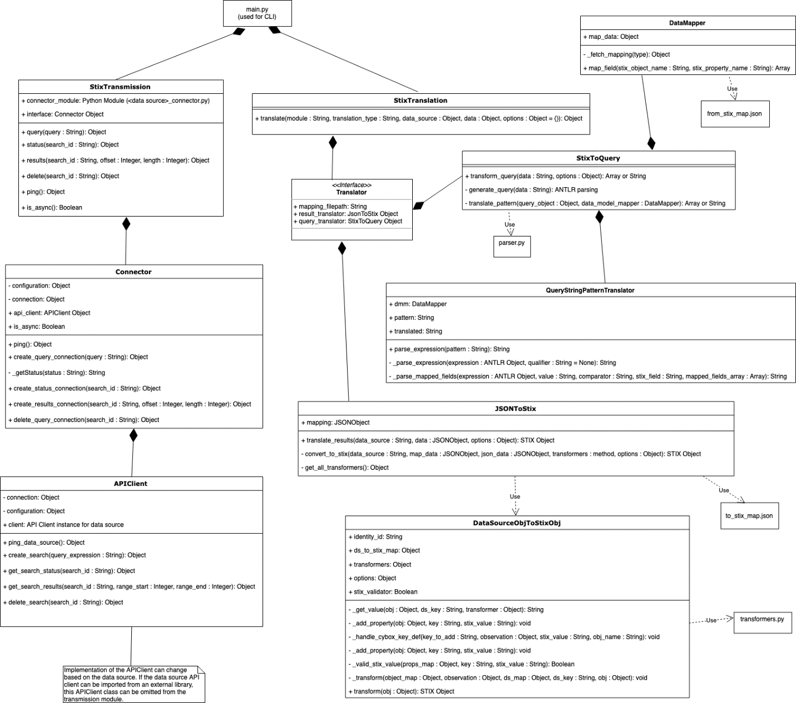

# Introduction

* [What is STIX?](#what-is-stix)
* [What is STIX-SHIFTER?](#what-is-stix-shifter)
* [What is a STIX-SHIFTER adapter?](#what-is-a-stix-shifter-adapter)
* [Glossary](#glossary)
* [Architecture Context](#architecture-context)

## What is STIX?

Structured Threat Information eXpression (STIX™) is a language and serialization format that organizations can use to exchange cyber threat intelligence (CTI). CTI is represented with objects and descriptive relationships and stored as JSON for machine readability. 

STIX delivers a consistent and machine-readable way to enable collaborative threat analysis, automated threat exchange, automated detection and response, and more. 
To learn more about STIX, see the following references:
* [Introduction to STIX](https://oasis-open.github.io/cti-documentation/stix/intro)
* [STIX and TAXII](https://docs.google.com/document/d/1yvqWaPPnPW-2NiVCLqzRszcx91ffMowfT5MmE9Nsy_w/edit?usp=sharing)

## What is STIX-SHIFTER?

STIX-shifter is an open source python library that you can access from https://github.com/IBM/stix-shifter.

The library offers the following key functions:
1.	Translation (stix_translation)
2.	Transmission (stix_transmission)

To learn more about the library, see https://github.com/IBM/stix-shifter/blob/master/README.md.

### Translation
With its translation module, you can:

* Translate a STIX 2 pattern to a native data source query

    ##### INPUT: STIX 2 pattern
    ```
    # STIX Pattern:
    "[url:value = 'http://www.testaddress.com'] OR [ipv4-addr:value = '192.168.122.84']"

    ```
    ##### OUTPUT: Native data source query

    ```
    # Translated Query:
    "SELECT * FROM tableName WHERE (Url = 'http://www.testaddress.com') 
    OR 
    ((SourceIpV4 = '192.168.122.84' OR DestinationIpV4 = '192.168.122.84'))"
    ```
* Translate a JSON data source query result to a STIX bundle of observable objects

    ##### INPUT: JSON data source query result
    ```
    # Datasource results:
    [
        { 
            "SourcePort": 567, 
            "DestinationPort": 102, 
            "SourceIpV4": "192.168.122.84", 
            "DestinationIpV4": "127.0.0.1", 
            "Url": "www.testaddress.com" 
        }
    ]
    ```
    ##### OUTPUT: STIX bundle of observable objects

    ```
    # STIX Observables
    {
        "type": "bundle",
        "id": "bundle--2042a6e9-7f34-4a03-a745-502e358594c3",
        "objects": [
            {
                "type": "identity",
                "id": "identity--3532c56d-ea72-48be-a2ad-1a53f4c9c6d8",
                "name": "YourDataSource",
                "identity_class": "events"
            },
            {
                "id": "observed-data--cf2c58dc-200e-49e0-b6f7-e1997cccf707",
                "type": "observed-data",
                "created_by_ref": "identity--3532c56d-ea72-48be-a2ad-1a53f4c9c6d8",
                "objects": {
                    "0": {
                        "type": "network-traffic",
                        "src_port": 567,
                        "dst_port": 102,
                        "src_ref": "1",
                        "dst_ref": "2"
                    },
                    "1": {
                        "type": "ipv4-addr",
                        "value": "192.168.122.84"
                    },
                    "2": {
                        "type": "ipv4-addr",
                        "value": "127.0.0.1"
                    },
                    "3": {
                        "type": "url",
                        "value": "www.testaddress.com"
                    }
                }
            }
        ]
    }
        
    ```


### Transmission
With the transmission module, you can connect to any products that house repositories of cybersecurity data. Examples of such products include SIEM systems, endpoint management systems, threat intelligence platforms, orchestration platforms, network control points, data lakes, and more. 

The module uses the data source APIs to:
* Ping the data source
* Send queries in the native language of the data source
* Fetch query status (if supported by the APIs)
* Fetch query results
* Delete the query (if supported by the APIs)


## What is a STIX-SHIFTER adapter?

A STIX-shifter adapter is the bridge that connects IBM Security Connect to a data source. Developing a new adapter expands on the data sources that STIX-shifter can support.

The combination of translation and transmission functions allows for a single STIX pattern to generate a native query for each supported data source. Each query is run, and the results are translated back into STIX objects; allowing for a uniform presentation of data. 

The objective is to have all the security data, regardless of the data source to look and behave the same. 

## Glossary

|Terms	                    | Definition 
|-------------------------- | -----------------------------
|Modules                    | Folders in the stix-shifter project that contains code that is specific to a data source.
|STIX 2 patterns	        | STIX patterns are expressions that represent Cyber Observable objects within a STIX Indicator STIX Domain Objects (SDOs). <br>They are helpful for modeling intelligence that indicates cyber activity.
|STIX 2 objects	            | JSON objects that contain CTI data. In STIX, these objects are referred to as Cyber Observable Objects.
|Data sources	            | Security products that house data repositories.
|Data source queries	    | Queries written in the data source's native query language.
|Data source query results	| Data returned from a data source query.

## Architecture Context


